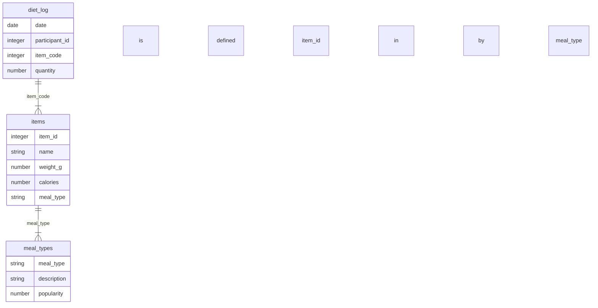

# Table-based categoricals

Table-based categoricals are a way to define categorical variables in a separate
table (rather than inline the field definition). This approach is useful for:

- Re-using categorical definitions across multiple fields
- Categorical defintiions that require extra metadata (e.g. hierarchical
  categorical structures)
- Categoricals with many levels

## Example

An example of table-based categoricals can be found in the
[datapackage.json](./datapackage.json) in the current directory.

The datapackage has the following model / relationship between tables:

