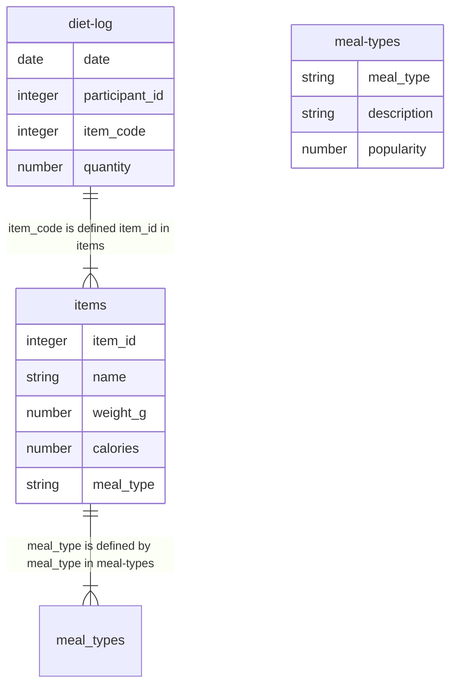

# Table-based categoricals

Table-based categoricals are a way to define categorical variables in a separate
table (rather than inline the field definition). This approach is useful for:

- Re-using categorical definitions across multiple fields
- Categorical defintiions that require extra metadata (e.g. hierarchical
  categorical structures)
- Categoricals with many levels

Table-based categoricals are defined by way of an extension of the `categories`
property used by inline categoricals. Table-based categoricals are defined by
setting `categories` to be an object of the following form:

```
{
    "resource": <resource name>,
    "valueField": <field name>,
    "labelField"?: <label field name>
}
```

(the `labelField` property is optional, similar to how the `label` property is
optional in inline categoricals)

## Example

An example of table-based categoricals can be found in the
[datapackage.json](./datapackage.json) in the current directory.

The datapackage has the following model / relationship between tables:



In this example, the field `item_code` in the `diet-log` resource is a
hierarchical categorical type defined by the `items` and `meal-types` resources.

## Relationship to `foreignKeys`

The table-based categorical approach is very similar to the `foreignKeys`
properties that can already be defined on table schemas.
[datapackage.foreignkeys.json](./datapackage.foreignkeys.json) illustrates how
the previous example could be defined using `foreignKeys` instead of table-based
`categories`.

This example illustrates some key differences between `foreignKeys` and
`categories`:

- `foreignKeys` are defined at the _schema_ level, whereas the `categories`
  property is defined at the _field_ level.
- Because `foreignKeys` are defined at the schema level, it makes it possible to
  use _multiple_ fields in a key, whereas `categories` is defined at the field
  level and can only be used to connect a single field to a foreign table
- The `categories` property allows you to define a `labelField` which can be
  used to define a label for the categorical level, which is not possible with
  `foreignKeys` (because it would not make sense when multiple fields are
  involved)
- When using the `categories` property, you can additionally define
  `categoriesOrdered` to indicate the value is ordinal. This is not possible
  with `foreignKeys` (again because it would not make sense when multiple fields
  are involved)

## Some theoretical questions

1. When we define a table-based `categories` property, should the referenced
   field automatically get a `unique` constraint?

1. When a `valueField` is not specified, should it default to the name of the
   current column?

1. Right now, `categoriesOrdered` is separate from the `categories` property.
   This means that when re-using a table-based categorical definition, it must
   be redefined in each field. Should `categoriesOrdered` be part of the Table
   referenced by `categories` somehow? Or should the concept of ordering remain
   decoupled?

1. What happens when definitions of `foreignKeys` and `categories` conflict?

1. Are all single-field `foreignKeys` functionally equivalent to `categories`?
   I.e. should single-field `foreignKeys` be considered categorical values?

1. Does the idea of value labels generalize to multi-field `foreignKeys`?
